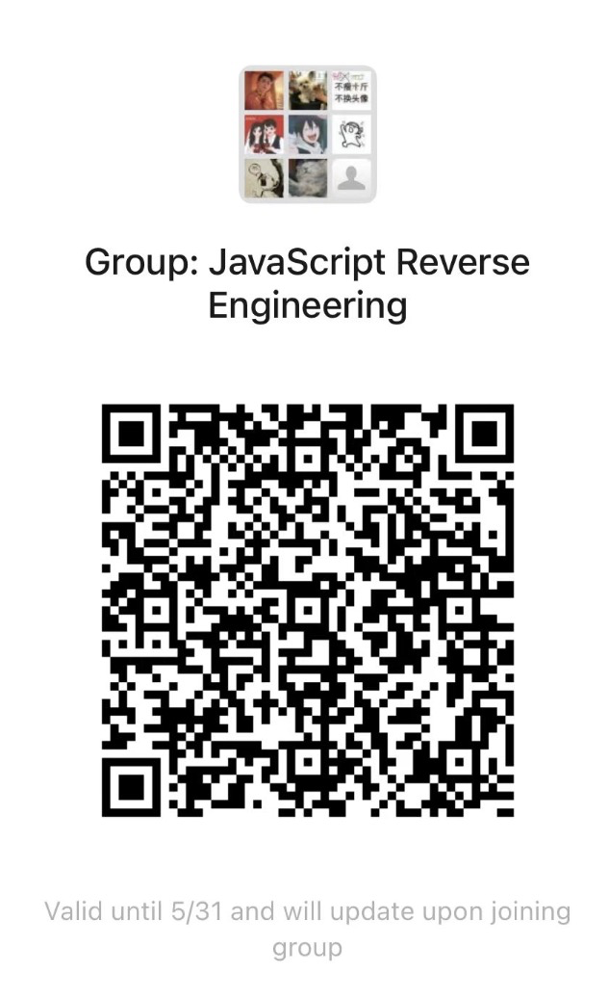
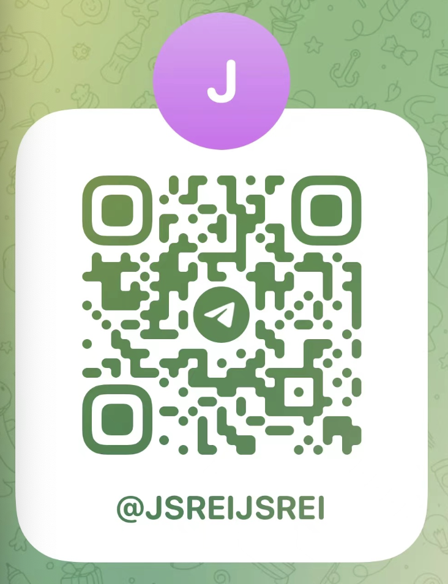

# jQuery Hook

GitHub Repository: https://github.com/JSREI/jQuery-hook

简体中文 | [English](./README_en.md)

# 一、此脚本的作用是什么？

用于快速定位使用`jQuery`绑定到`DOM`元素上的事件的代码的真实位置，辅助逆向分析。

# 二、为什么会有这个？

`jQuery`曾经引领过一个时代，虽然现已没落，但是很多遗留下来的系统都用到了`jQuery`，其市场还是比较大的， 而笔者在做`js`逆向的时候发现用`Chrome`自带的开发者工具查看元素绑定事件的功能，看到的值是被`jQuery`包裹着一层的代码：

这是因为`jQuery`在原生的`DOM`元素事件机制上自己定义了一套事件管理机制，这套机制为开发者带来了便利，比如可以很方便的对某个`DOM`元素的相同事件绑定多个回调方法，但同时也为逆向带来不方便，逆向者不太容易能定位到`DOM`事件代码逻辑真实代码所在的位置，而这个小脚本就是解决这个问题的，**提供了一种简单有效的方法能够快速定位到`jQuery DOM`元素事件对应的真实代码的位置**。

# 三、安装

## 3.1 从油猴商店安装（推荐方式）

此脚本已在油猴商店上架，点击下面的链接，直接在油猴商店安装快捷方便，并且后续此脚本有版本更新油猴插件会自动提示升级：  

[https://greasyfork.org/zh-CN/scripts/435556-jquery-hook](https://greasyfork.org/zh-CN/scripts/435556-jquery-hook)

## 3.2 手动安装

手动复制此仓库的`main`分支的根目录下的`jQuery-hook.js`文件到您自己的油猴插件新建一个脚本粘贴代码即可： 

```
https://github.com/JSREI/jQuery-hook/blob/main/jQuery-hook.js
```

注意此种方式后续此脚本有版本更新油猴插件不会自动提醒升级，不过您可以`star`/`watch`本仓库关注后续更新。

# 四、使用案例
随便找一个使用`jQuery`开发的网站，比如这个：  

[http://wap.wfu.edu.cn:8001/authz/login/slogin](http://wap.wfu.edu.cn:8001/authz/login/slogin)

尝试触发登录请求，会发现它发出的登录请求中密码对应的参数`mm`是被加密传输的：


通过这里可以看到，发出的请求是`doc`类型的请求，看起来是使用表单提交的方式发送的请求：

那么按照我们以往的js逆向经验来推测：

- 应该是单击“登录”按钮的时候触发了按钮绑定的`click`事件
- `click`事件的`js`代码获取密码对应的名为`mm`的`input`里的明文密码的值，进行加密得到密码的加密值
- 然后更新密码的`mm input`的值为加密后的密码的值
- 然后提交表单，此时请求中的密码参数`mm`就是被加密后的值了 

当然上面都是我们基于经验脑补出来的过程，具体还是得找到事件代码看一眼才靠谱，在`Chrome`中使用查看元素功能选中这个登录按钮，左侧会自动切换到`Elements`标签并定位到`DOM`元素的代码位置，然后在右侧切换到`Event Listener`标签查看此元素绑定的事件，发现是有一个`click`事件，只是代码位置是在`jQuery`里，不必在意这些细节，大喜，于是单击跟进去这个代码位置：  

  
然后会陷入到`jQuery`的闭包中无法自拔，喜早了，这是因为`jQuery`自己封装了一套事件机制不太容易逆向：
  
此时就是这个脚本发挥作用的时候了，油猴插件开启本脚本`jQuery hook`，刷新页面重新加载以便脚本能够注入到页面，如果加载成功控制台会有提示：  

  
再次对登录按钮检查元素，不必理睬右边`Event Listener`里`Chrome`给出的的绑定事件， 注意左边`Elements`面板中使用`jQuery`绑定的事件都已经以元素属性的方式展示出来了：

  
比如：

```text
cc11001100-jquery-click-event-function="cc11001100_click_5"
```
表示此元素上有一个click类型的事件，这个事件所关联的回调函数的代码已经赋值到这个名称的全局变量上：
```text
cc11001100_click_5
```
然后我们在开发者工具中切换到`console`，粘贴这个全局变量的名称`cc11001100_click_5`并回车，查看它的内存地址：

然后单击内存地址跟进去，就直接定位到了登录按钮的`click`事件所绑定的代码：

往下拉，可以看到参数`mm`的加密方式：


至此梳理完毕，以比较科学的方式很轻松就定位到了加密位置，逆向不是体力活，这才是逆向的乐趣啊！

# 五、原理概述
通过`hook` `jQuery`的`$.fn`原型上的一些设置事件的方法来实现，目前支持的`jQuery`事件方法：

```text
"click", 
"dblclick", 
"blur", 
"change", 
"contextmenu", 
"error", 
"focus",
"focusin", 
"focusout", 
"hover", 
"holdReady", 
"proxy", 
"ready", 
"keydown", 
"keypress",
"keyup", 
"live", 
"load", 
"mousedown", 
"mouseenter", 
"mouseleave", 
"mousemove", 
"mouseout",
"mouseover", 
"mouseup"
"on"
```

元素每被设置一个事件就会多一个属性，复制这个属性的值，对应着一个全局变量，在`console`上粘贴，这个就是此元素的此事件对应着的真实代码位置。

# 六、问题反馈

- 如果发现有`Hook`不到的情况，请在[issue](https://github.com/JSREI/jQuery-hook/issues)中反馈
- 任何诉求与建议，请在[issue](https://github.com/JSREI/jQuery-hook/issues)中反馈
- 如果您觉得此项目有任何可改进的地方（不仅局限于文档、代码）并且懒得说一堆话解释想直接上手改，欢迎提`pr`

# 七、Contributions

<div>
    <ul style="list-style: none; outside: none; margin:0px; padding: 0px;">
        <li style="float: left; margin: 0 10px; display:inline;">
            <a href="https://github.com/cc11001100">
                <br/>CC11001100
            </a>
        </li>
        <li style="float: left; margin: 0 10px; display:inline;">
            <a href="https://github.com/dingcang">
                <br/>我要一个番茄
            </a>
        </li>
        <li style="float: left; margin: 0 10px; display:inline;">
            <a href="https://github.com/mic1on">
                <br/>MicLon
            </a>
        </li>
    </ul>    
</div>

# 八、TODO
- 对`jQuery`发出的请求进行监控和`Hook` 
  - 如果希望有其它功能在[issue](https://github.com/CC11001100/jQuery-hook/issues)区留言讨论 

# 八、逆向技术交流群

扫码加入逆向技术交流群：



如群二维码过期，可以加我个人微信，发送【逆向群】拉你进群：


[点此](https://t.me/jsreijsrei)或扫码加入TG交流群：



