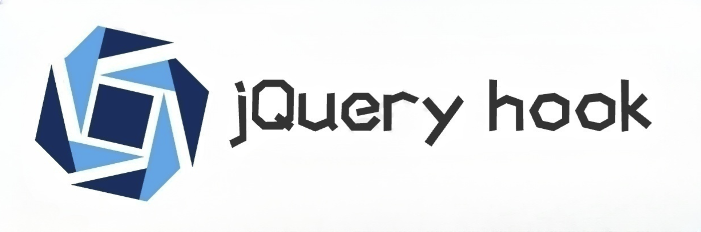

# jQuery Hook

GitHub Repository: https://github.com/JSREI/jQuery-hook

[简体中文](./README.md) | English


                         



# I. What is the purpose of this script?

It is designed to swiftly identify the actual code location that binds events to `DOM` elements using `jQuery`, facilitating reverse engineering analysis.

# II. Why does this exist?

Though `jQuery` has seen better days, it still persists in many legacy systems, maintaining a significant market share. During the author's journey through `js` reverse engineering, it was observed that the Chrome developer tools, when used to inspect element event bindings, reveal code encapsulated by `jQuery`:

This封装 occurs because `jQuery` has superimposed its own event management system over the native `DOM` element event mechanism. While this system offers developers conveniences, such as the ability to easily attach multiple callback methods to the same event of a `DOM` element, it poses challenges for reverse engineering efforts. It's not straightforward for reversers to pinpoint the actual code location of `DOM` event logic. This script addresses this issue, **offering a straightforward and potent approach to swiftly identify the true code location associated with `jQuery DOM` element events**.

# III. Installation

## 3.1 Install from the Greasy Fork Store (Recommended Method)

The script is readily available on the Greasy Fork Store. Click the link below to install it directly from the store with ease and speed. Additionally, should the script be updated in the future, the Greasy Fork extension will automatically notify you to upgrade.

[Install jQuery Hook from Greasy Fork](https://greasyfork.org/zh-CN/scripts/435556-jquery-hook) 

## 3.2 Manual Installation

Copy the `jQuery-hook.js` file manually from the root directory of the `main` branch of this repository into your Greasemonkey plugin to create a new script and paste the code.

```
[Download jQuery-hook.js](https://github.com/JSREI/jQuery-hook/blob/main/jQuery-hook.js)
```

Please be aware that with this approach, the Greasemonkey plugin will not automatically notify you of updates to this script. However, you can `star`/`watch` this repository to stay informed about future updates.

# 4. Usage Example

Locate any website developed with `jQuery`, for instance:

[Example Website](http://wap.wfu.edu.cn:8001/authz/login/slogin) 

Initiate a login request, and you will notice that the password parameter `mm` in the login request is encrypted during transmission.


From this perspective, it's evident that the request sent is of the `doc` type, seemingly dispatched via the form submission method.

Drawing on our past experience with js reverse engineering, we can deduce:

- The `click` event bound to the "Login" button is likely triggered upon clicking the button.
- The `click` event's `js` code retrieves the plaintext password value from the `input` named `mm`, encrypts it to obtain the encrypted password value.
- It then updates the value of the `mm input` to the encrypted password value.
- The form is subsequently submitted, and the password parameter `mm` in the request is now the encrypted value.

Of course, the above is all speculative based on experience; the actual event code must be examined for certainty. Using the element inspection feature in `Chrome` to select the login button, the left side automatically switches to the `Elements` tab and locates the code position of the `DOM` element. Then, switch to the `Event Listener` tab on the right to view the events bound to this element and discover a `click` event, albeit with the code position within `jQuery`. Pay no mind to these details, rejoice, and click through to this code location:

  
Then you find yourself ensnared in `jQuery`'s closure, prematurely excited, because `jQuery` has encapsulated its own event mechanism, which is not easily reversible:
  
This is where the script comes into play. Enable the Greasemonkey plugin with this script `jQuery hook`, refresh the page to reload so that the script can be injected into the page. If the loading is successful, a prompt will appear in the console:

  
Inspect the login button again, disregarding the bound events provided by `Chrome` in the `Event Listener` on the right. Note that the events bound by `jQuery` in the `Elements` panel on the left are now displayed as element attributes:

  
For example:

```text
cc11001100-jquery-click-event-function="cc11001100_click_5"
```
This indicates that there is a click event on this element, and the code associated with this event's callback function has been assigned to a global variable with this name:
```text
cc11001100_click_5
```
Then, switch to the `console` in the developer tools, paste the name of this global variable `cc11001100_click_5`, and press enter to view its memory address:

Click the memory address to navigate directly to the code bound to the `click` event of the login button:

Scroll down to see the encryption method of the parameter `mm`:


With this, the process is clear. We have easily located the encryption position in a more scientific manner. Reverse engineering is not a laborious task; this is the joy of reverse engineering!

# V. Principle Overview
It is implemented by `hooking` some event setting methods on the prototype of `jQuery`'s `$.fn`. The currently supported `jQuery` event methods are:

```text
"click", 
"dblclick", 
"blur", 
"change", 
"contextmenu", 
"error", 
"focus",
"focusin", 
"focusout", 
"hover", 
"holdReady", 
"proxy", 
"ready", 
"keydown", 
"keypress",
"keyup", 
"live", 
"load", 
"mousedown", 
"mouseenter", 
"mouseleave", 
"mousemove", 
"mouseout",
"mouseover", 
"mouseup"
"on"
```

Each time an element is assigned an event, an additional attribute is created. Copy the value of this attribute, which corresponds to a global variable. Paste it in the `console`, and this is the actual code location associated with this element's event.

# VI. Feedback

- If you encounter any events that are not `Hooked`, please provide feedback in the [issue](https://github.com/JSREI/jQuery-hook/issues) section.
- For any requests or suggestions, please provide feedback in the [issue](https://github.com/JSREI/jQuery-hook/issues) section.
- If you feel that this project has any areas for improvement (not limited to documentation, code) and prefer to jump straight into making changes rather than explaining at length, welcome to submit a `pr`.

# VII. Contributions

<div>
    <ul style="list-style: none; outside: none; margin:0px; padding: 0px;">
        <li style="float: left; margin: 0 10px; display:inline;">
            <a href="https://github.com/cc11001100"> 
                <br/>CC11001100
            </a>
        </li>
        <li style="float: left; margin: 0 10px; display:inline;">
            <a href="https://github.com/dingcang"> 
                <br/>I want a tomato
            </a>
        </li>
        <li style="float: left; margin: 0 10px; display:inline;">
            <a href="https://github.com/mic1on"> 
                <br/>MicLon
            </a>
        </li>
    </ul>    
</div>


# VIII. TODO

- Monitor and `Hook` requests issued by `jQuery`.
  - If you wish for additional features, please discuss in the [issue](https://github.com/CC11001100/jQuery-hook/issues) section.

# IX. Reverse Engineering Technical Discussion Group

Scan the QR code to join the reverse engineering technical discussion group:


If the group QR code has expired, you can add my personal WeChat, send "Reverse Engineering Group" and I will invite you to the group:


[Click here](https://t.me/jsreijsrei) or scan the QR code to join the TG discussion group:


