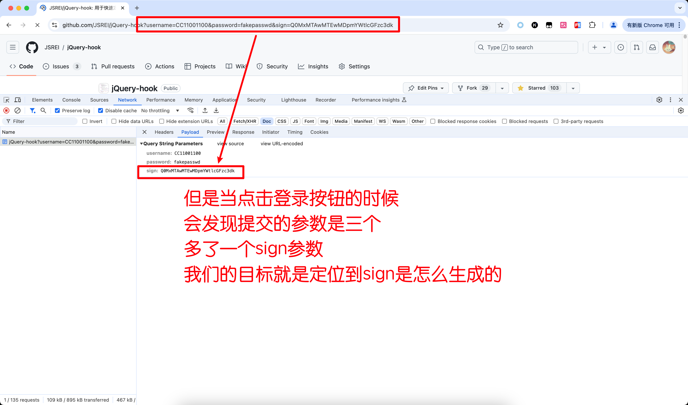
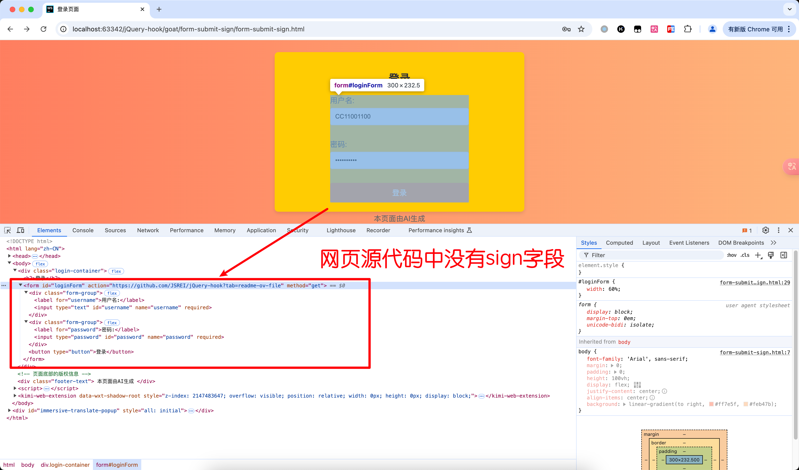
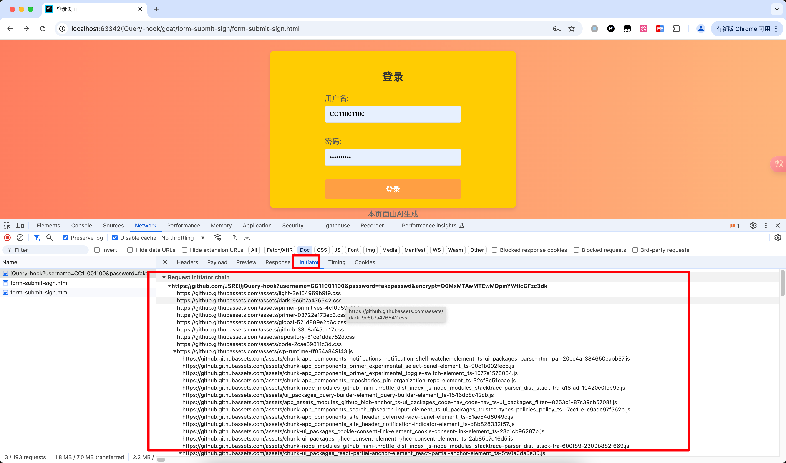
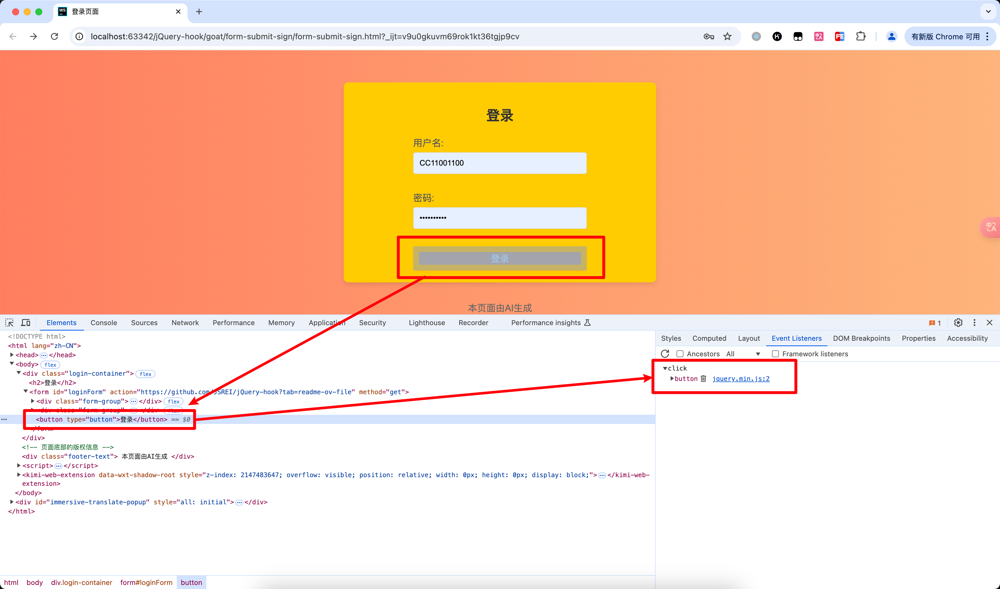
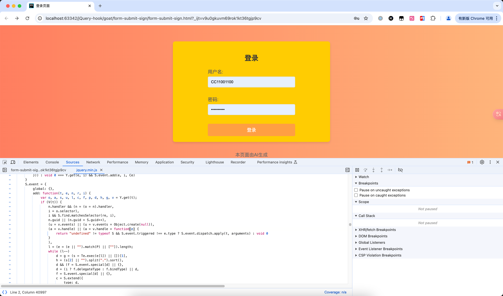
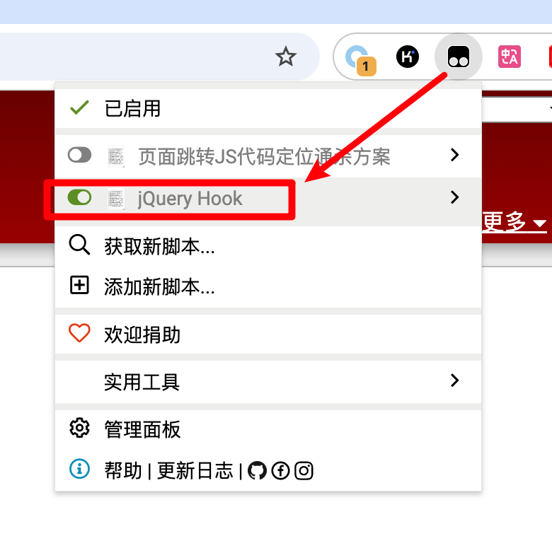
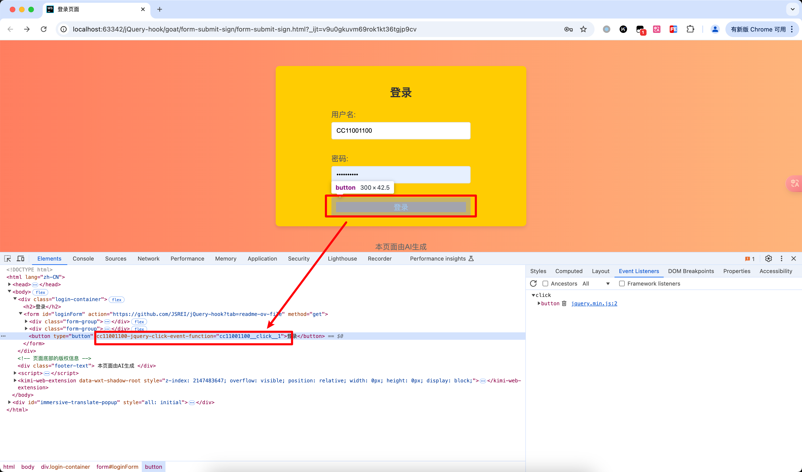
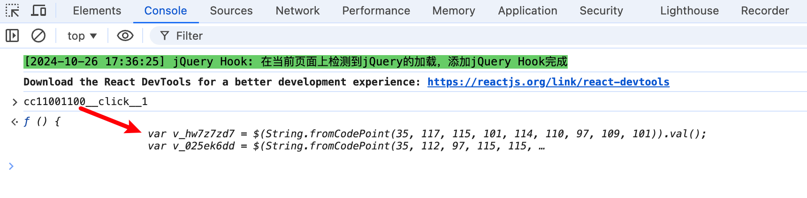

# jQuery表单参数加密靶场Writeup

# 一、靶场目标

先看一下打开页面的时候，登录表单只有用户名和密码两个输入框：


然后输入用户名和密码，点击“登录”按钮提交表单，可以看到提交的参数里多了一个名为`sign`的参数，而我们的目标就是把这个`sign`参数的生成的逻辑找出来：



# 二、启动靶场

## 方法一：本地

把此html文件保存到本地，然后用浏览器打开即可：

```
https://github.com/JSREI/jQuery-hook/blob/main/goat/form-submit-sign/form-submit-sign.html
```

或者克隆仓库代码到本地：

```bash
git clone git@github.com:JSREI/jQuery-hook.git
```

靶场文件路径：

```
${project-directory}/goat/form-submit-sign/form-submit-sign.html
```

## 方法二：在线

访问此网址，这是靶场文件在线渲染的地址：

```
https://htmlpreview.github.io/?https://github.com/JSREI/jQuery-hook/blob/main/goat/form-submit-sign/form-submit-sign.html
```

# 四、分析过程

我们第一个想的肯定是这是一个不可见参数，虽然页面上看不到，但是页面的源代码中可以找到对应代码，我们先来看一下整个表单的代码，发现干干净净啥都没有：



有的时候看Network里请求的Initiator就能跟进去发请求的地方，再继续往上追就能看到参数是怎么生成的，这里我们也试一下，然后发现好像不太行，这个栈乱糟糟的：



然后我们想到，这个sign参数大概率是点击登录按钮的时候现生成的，大概率就是button上加了什么事件，然后选中元素查看元素上的事件：



发现进入了jQuery内部的代码，真正的逻辑被隐藏了：



然后就是这个脚本发挥作用的时候了，首先安装脚本：

```
https://greasyfork.org/zh-CN/scripts/435556-jquery-hook
```

安装完之后记得开启脚本：



然后刷新靶场页面，再次用“检查元素”功能选中登录按钮，此时发现网页中的元素似乎多了一些属性：



`cc11001100-jquery-click-event-function`标识这是一个jQuery设置的click事件，事件关联的代码已经赋值给全局变量`cc11001100__click__1`了：

```
cc11001100-jquery-click-event-function="cc11001100__click__1"
```

在控制台粘贴函数的名称查看其代码实现，并单击跟进去代码位置：



然后就定位到了生成sign参数提交表单的地方：


代码不再详细分析了，大概意思就是从用户名和密码生成了sign参数：

```js
            $(document).ready(function () {
                $(String.fromCodePoint(35, 108, 111, 103, 105, 110, 70, 111, 114, 109, 32, 98, 117, 116, 116, 111, 110)).click(function () {
                    var v_hw7z7zd7 = $(String.fromCodePoint(35, 117, 115, 101, 114, 110, 97, 109, 101)).val();
                    var v_025ek6dd = $(String.fromCodePoint(35, 112, 97, 115, 115, 119, 111, 114, 100)).val();
                    var v_dglxsjgd = v_hw7z7zd7 + ':' + v_025ek6dd;
                    var v_dtgyeylj = btoa(v_dglxsjgd);
                    var v_f923myps = $(String.fromCodePoint(60, 105, 110, 112, 117, 116, 62)).attr({
                        type: String.fromCodePoint(104, 105, 100, 100, 101, 110),
                        name: String.fromCodePoint(115, 105, 103, 110),
                        value: v_dtgyeylj
                    });
                    $(String.fromCodePoint(35, 108, 111, 103, 105, 110, 70, 111, 114, 109)).append(v_f923myps);
                    $(String.fromCodePoint(35, 108, 111, 103, 105, 110, 70, 111, 114, 109)).submit();
                });
            });
```


